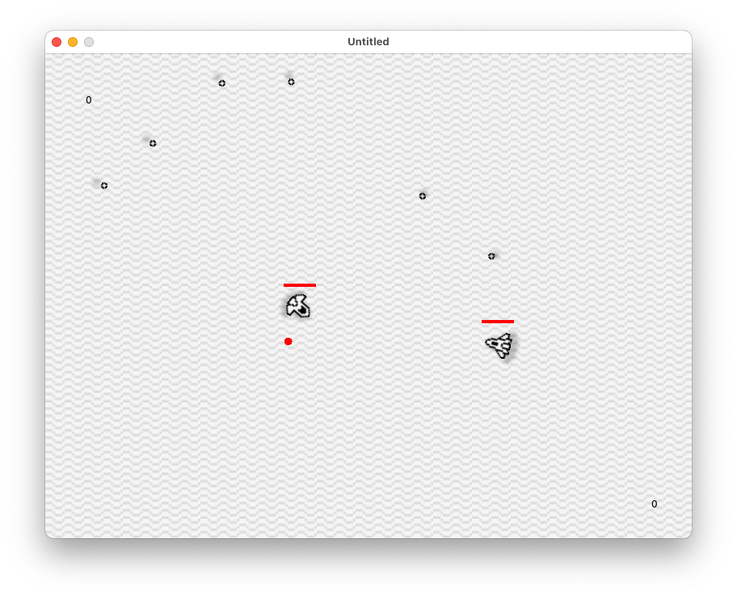

# ships

> Two player space(?) ship dogfighting game



## Tech

- This is a [Lua](https://lua.org/) code base, built on top of the [LÖVE](https://love2d.org/) game development framework
- Uses [moonshine](https://github.com/vrld/moonshine) for shaders

## Prerequisites

Install Love on your machine, preferably with [Homebrew](https://formulae.brew.sh/cask/love):

```shell
$ brew install --cask love
```

## Run

Clone this repository, then

```shell
$ cd ships
$ love .
```

## Assets and credits

- Tutorials and thorough explanation on vectors, inertia, attraction etc from [The Nature of Code](https://natureofcode.com/forces/) by Daniel Shiffman
- Sprites are my own, crafted with [Aseprite](https://www.aseprite.org/)
